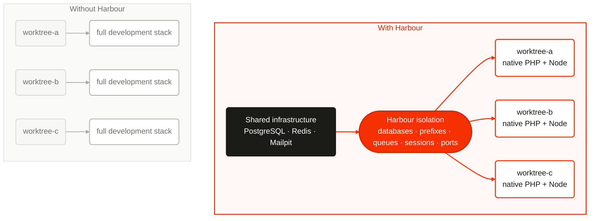

# Harbour

[](https://github.com/pickeringtech/harbour/actions/workflows/ci.yml)
[](LICENSE)

**Lightweight isolated Laravel environments for parallel development.**

> Share infrastructure where practical. Isolate mutable state where necessary.
> Make every Laravel checkout immediately usable.

Harbour gives every Laravel clone or Git worktree its own ports, database,
Redis namespaces, sessions, queues, and environment—without launching another
complete PHP, database, Redis, and Node stack. PHP and Node stay native; shared
infrastructure stays shared.

<!-- harbour:diagram id="shared-infrastructure" alt="Without Harbour, each worktree runs a full stack. With Harbour, native worktrees use isolated namespaces on shared infrastructure." -->


We love Sail. It does an excellent job of giving a Laravel project a complete,
reproducible Docker development stack. Harbour addresses a narrower need: when
many clones or worktrees run in parallel, repeating that complete stack for
every checkout is unnecessarily heavyweight. Harbour keeps the native Laravel
workflow and shares infrastructure while isolating each workspace's mutable
state. The two tools serve different development modes and work well together.

## Install

Run these once in the Laravel project's primary checkout:

```bash
composer require --dev pickeringtech/harbour
php artisan workspace:install
```

The first command adds Harbour as a development-only dependency. It starts
nothing and changes no infrastructure.

The second command inspects the project and shows one reviewable proposal:

- existing Sail/Compose services from `compose.yaml`, `compose.yml`, or the
  `docker-compose.*` equivalents;
- Herd services from `herd.yml`;
- Laravel choices and host ports from `.env` and `.env.example`; or
- SQLite, file-backed state, and log mail when no infrastructure is configured.

Accept once, or decline to choose the database, cache, mail transport, and
optional services individually. Harbour then creates `.env.harbour` and
`config/harbour.php`, safely appends its state paths to `.gitignore`, and adds
Composer workspace aliases when those names are free. Existing project files
and scripts are never replaced.

Harbour reads Sail and Herd configuration; it does not silently start, rewrite,
or take ownership of either tool. It configures native Laravel processes to use
their published host ports and shared services safely.

For deterministic agent or CI installation, accept discovery without prompts:

```bash
php artisan workspace:install --detect --no-interaction
```

Or make every choice explicit:

```bash
php artisan workspace:install \
    --database=postgresql \
    --cache=redis \
    --mail=mailpit \
    --with=meilisearch,minio \
    --no-interaction
```

The main groups also accept `-d`, `-c`, and `-m`. See the
[installation guide](https://pickeringtech.github.io/harbour/getting-started/)
for the supported Sail-compatible services and exact detection rules.

## Five-minute workflow

Commit the project-level files created by `workspace:install`. Then a new clone
or worktree needs only:

```bash
composer install
composer workspace:setup
```

`composer install` restores `vendor/`, which Git worktrees do not share.
`workspace:setup` identifies this checkout, atomically reserves ports, creates
its isolated database and Laravel namespaces, preserves and renders `.env`,
runs normal migrations, and starts only explicitly configured optional Docker
resources.

Inspect it:

```bash
composer workspace:status
php artisan workspace:debug
```

Before the external tool removes the worktree:

```bash
composer workspace:teardown -- --force
```

Teardown removes only resources Harbour can prove it owns and restores the
original `.env`. `--force` skips interaction; it never weakens ownership or path
safety.

## Core commands

| Command | Purpose |
| --- | --- |
| `workspace:install` | Prepare and commit the project's Harbour policy once. |
| `workspace:setup` | Create or reconcile this checkout's isolated environment. |
| `workspace:status` | Read its concise persisted status without scanning the machine. |
| `workspace:env` | Emit table, JSON, dotenv, or safely escaped shell variables. |
| `workspace:render` | Re-render `.env` from the current state and template. |
| `workspace:debug` | Explain variable provenance while redacting secrets. |
| `workspace:teardown` | Remove proven-owned resources and restore `.env`. |

Commands intended for automation support stable JSON output and error codes.

## Environment template

Harbour renders one deliberately small template, `.env.harbour`. Interpolation
supports only `${VARIABLE}`; an unresolved variable fails instead of becoming
an empty string.

```dotenv
APP_NAME=Acme
APP_ENV=local
APP_KEY=${APP_KEY}
APP_URL=${APP_URL}

DB_CONNECTION=pgsql
DB_HOST=127.0.0.1
DB_PORT=5432
DB_DATABASE=${DB_DATABASE}

REDIS_PREFIX=${REDIS_PREFIX}
CACHE_PREFIX=${CACHE_PREFIX}
SESSION_COOKIE=${SESSION_COOKIE}
REDIS_QUEUE=${REDIS_QUEUE}
HORIZON_PREFIX=${HORIZON_PREFIX}

VITE_PORT=${VITE_PORT}
REVERB_PORT=${REVERB_PORT}
REVERB_SERVER_PORT=${REVERB_PORT}
```

Laravel's default `public/hot` file is already local to each worktree, so normal
Laravel Vite projects need no hot-file customization. Run Vite with its allocated
port, or let your process launcher import `workspace:env`. Advanced custom hot
files are also supported without an `AppServiceProvider` edit.

## Proven in real worktrees

The release acceptance job creates a real Laravel 13 application and two real
Git worktrees, installs them concurrently, launches Vite and Reverb on distinct
ports, proves PostgreSQL and Redis isolation, exercises optional Docker and
Compose resources, tears one workspace down without affecting the other, then
repeats cleanup after a deliberately failed setup.

The quality gate also includes PostgreSQL, MySQL/MariaDB, SQLite, Redis, Docker,
Compose, multi-process concurrency, failure injection, property/fuzz testing,
strict Larastan, formatting, mutation testing, and a 95% coverage minimum.

## Documentation

- [Getting started](https://pickeringtech.github.io/harbour/getting-started/) — installation, discovery, and the first workspace
- [Workspaces](https://pickeringtech.github.io/harbour/workspaces/) — clones, worktrees, identity, setup, and teardown
- [Environment templates](https://pickeringtech.github.io/harbour/environment-templates/) — variables, precedence, and secrets
- [Databases](https://pickeringtech.github.io/harbour/databases/) and [Laravel state isolation](https://pickeringtech.github.io/harbour/laravel-state/) — databases, Redis, cache, sessions, queues, and Horizon
- [Vite and Reverb](https://pickeringtech.github.io/harbour/vite-and-reverb/) — collision-free development processes
- [Docker](https://pickeringtech.github.io/harbour/docker/) and [Docker Compose](https://pickeringtech.github.io/harbour/docker-compose/) — optional workspace resources
- [Orca](https://pickeringtech.github.io/harbour/orca/) and [Herdr](https://pickeringtech.github.io/harbour/herdr/) — copy/pasteable integration recipes
- [Safety and resource ownership](https://pickeringtech.github.io/harbour/safety/) — why teardown is trustworthy
- [Architecture](https://pickeringtech.github.io/harbour/architecture/) — lifecycle and design decisions

## Requirements and non-goals

Harbour supports PHP 8.4+, Laravel 13+, Linux, and macOS. Docker is needed only
for projects that opt into Docker or Compose resources.

Harbour does not create Git worktrees, manage coding agents, install PHP or
Node, supervise long-running processes, require Docker, replace Compose or
Sail, deploy production systems, or support non-Laravel frameworks.

## Security

Please report vulnerabilities privately as described in [SECURITY.md](SECURITY.md).
See [CONTRIBUTING.md](CONTRIBUTING.md) for development and release quality gates.

## License

Harbour is open-source software licensed under the [MIT License](LICENSE).

Made with love by [Pickering Technologies (PickTech)](https://picktech.co.uk/).

**Sail less. Ship more.**
