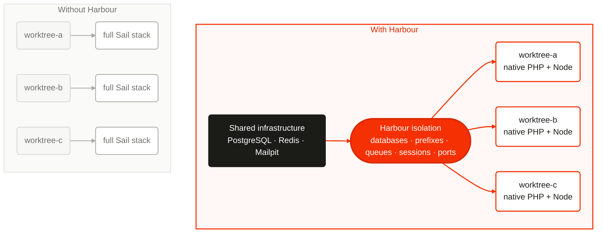

# Harbour

[](https://github.com/pickeringtech/harbour/actions/workflows/ci.yml)
[](LICENSE)

**Lightweight isolated Laravel environments for parallel development.**

> Share infrastructure where practical. Isolate mutable state where necessary.
> Make every Laravel checkout immediately usable.

Harbour makes a Laravel clone or Git worktree ready with one command. PHP and
Node stay native; PostgreSQL, Redis, Mailpit, MinIO, and similar infrastructure
can stay shared. Harbour allocates workspace ports, creates a database,
namespaces Laravel's mutable state, renders `.env`, and remembers exactly what
it owns so teardown is safe.

[Read the documentation](https://pickeringtech.github.io/harbour/) or jump to
the [two-command installation](https://pickeringtech.github.io/harbour/getting-started/).

<!-- harbour:diagram id="shared-infrastructure" alt="Without Harbour, each worktree runs a full stack. With Harbour, native worktrees use isolated namespaces on shared infrastructure." -->


Harbour is not anti-Sail. It is for the high-density case where running an
entire application stack for every worktree costs more than the isolation it
provides.

## Requirements

- PHP 8.4 or newer
- Laravel 13 or newer
- Linux or macOS (Windows is supported where its Unix-oriented operations map
  cleanly)
- PDO driver(s) for the database you use
- Docker only when a project configures Docker or Compose resources

## Install

Project maintainers install Harbour and prepare the repository once:

```bash
composer require --dev pickeringtech/harbour
php artisan workspace:install
```

The first command adds Harbour as a development-only dependency. The install
command asks which database, cache, mail transport, and optional shared
services the project uses. It then creates a matching `.env.harbour` and
`config/harbour.php`, adds Harbour state to `.gitignore`, and adds the three
Composer workspace aliases below when their names are unused. It never
replaces existing project files or scripts.

For agents and CI, make every choice explicit instead of opening prompts:

```bash
php artisan workspace:install \
    --database=postgresql \
    --cache=redis \
    --mail=mailpit \
    --with=meilisearch,minio \
    --no-interaction
```

Short forms are available for the main groups: `-d`, `-c`, and `-m`.
`--with` accepts Sail's service names: `mysql`, `pgsql`, `mariadb`, `mongodb`,
`redis`, `valkey`, `memcached`, `meilisearch`, `typesense`, `minio`, `rustfs`,
`mailpit`, `rabbitmq`, `selenium`, and `soketi`. Harbour also offers native
choices such as SQLite, file/database cache, log mail, and `none`.

Unlike Sail, these selections describe existing **shared** infrastructure.
Harbour creates workspace-safe logical resources and configuration; it does
not launch a full dependency stack for every checkout. Docker and Compose
remain explicit opt-in resource providers.

Review and commit those project-level changes. After that, every new clone or
worktree needs only:

```bash
composer install
composer workspace:setup
```

`composer install` installs the checkout's PHP dependencies. `workspace:setup`
creates that checkout's isolated ports, database, namespaces, environment, and
configured optional services, then runs normal migrations.

The installer adds these orchestration-neutral aliases transparently:

```json
{
    "scripts": {
        "workspace:setup": [
            "@php artisan workspace:setup"
        ],
        "workspace:status": [
            "@php artisan workspace:status"
        ],
        "workspace:teardown": [
            "@php artisan workspace:teardown"
        ]
    }
}
```

Then:

```bash
composer workspace:setup
composer workspace:status
composer workspace:teardown -- --force
```

Status only reads the persisted workspace record. Teardown removes resources
Harbour can prove it owns and restores the pre-setup `.env`. `--force` skips
the confirmation prompt; it never weakens ownership checks.

Harbour safely appends neither arbitrary files nor Git state. Commit
`.env.harbour` and `config/harbour.php`; ignore `.env`, `.harbour.json`, and
`.harbour/`.

## A realistic `.env.harbour`

Interpolation intentionally supports only `${VARIABLE}`. A missing variable is
an error, never an empty string.

```dotenv
APP_NAME=Acme
APP_ENV=local
APP_KEY=${APP_KEY}
APP_DEBUG=true
APP_URL=${APP_URL}

DB_CONNECTION=pgsql
DB_HOST=127.0.0.1
DB_PORT=5432
DB_DATABASE=${DB_DATABASE}
DB_USERNAME=postgres
DB_PASSWORD=${DB_PASSWORD}

REDIS_HOST=127.0.0.1
REDIS_PORT=6379
REDIS_PREFIX=${REDIS_PREFIX}
CACHE_PREFIX=${CACHE_PREFIX}
SESSION_COOKIE=${SESSION_COOKIE}
QUEUE_PREFIX=${QUEUE_PREFIX}
REDIS_QUEUE=${REDIS_QUEUE}
HORIZON_PREFIX=${HORIZON_PREFIX}

VITE_PORT=${VITE_PORT}
VITE_HOT_FILE=${VITE_HOT_FILE}

REVERB_HOST=127.0.0.1
REVERB_PORT=${REVERB_PORT}
```

`APP_KEY` and database credentials can come from the pre-Harbour `.env` or the
process environment. Mark custom credentials as secrets in config; diagnostics
redact them and state never persists their values.

## What setup does

`workspace:setup` acquires a per-checkout lifecycle lock, resolves a stable
identity, atomically reserves ports in the XDG state registry, backs up `.env`,
creates and ownership-marks the database, provisions optional Docker resources,
renders `.env`, runs normal migrations and optional seeding, then runs hooks.
Every acquired resource is written to `.harbour.json` immediately.

Running setup twice converges on the same workspace. If a process is killed,
the partial state remains sufficient for:

```bash
composer workspace:teardown -- --force
```

`--fresh --force` rebuilds only resources whose persisted and external
ownership evidence matches. It never means “drop the currently configured
database”.

## Git worktrees

Harbour does not create or remove worktrees:

```bash
git worktree add ../acme-feature -b feature/payment-retry
cd ../acme-feature

composer install
composer workspace:setup

# Work, test, commit through your normal Git workflow.

composer workspace:teardown -- --force
cd ../acme
git worktree remove ../acme-feature
```

Primary checkouts, detached HEADs, and non-Git Laravel projects work too.
Branch text is display metadata, not an unsafe SQL/Docker/shell identifier.

## Laravel integration

### Redis, cache, sessions, queues, and Horizon

Laravel 13's stock configuration already reads `REDIS_PREFIX`, `CACHE_PREFIX`,
`SESSION_COOKIE`, and `REDIS_QUEUE`. Horizon projects should make their prefix
environment-driven if it is not already:

```php
// config/horizon.php
'prefix' => env('HORIZON_PREFIX', 'horizon:'),
```

The general Redis prefix isolates Redis queue internals, while `REDIS_QUEUE`
also gives each worker an explicit queue name. Start workers after importing the
workspace environment:

```bash
eval "$(php artisan workspace:env --format=shell)"
php artisan queue:work redis --queue="$REDIS_QUEUE"
```

Workers are not supervised by Harbour. Database and SQS queues obtain isolation
from their own database/queue configuration; Harbour's Redis guarantees do not
magically apply to an external broker.

Cookies are scoped by name because browser cookies do not use ports as part of
their scope. Thus two apps at `127.0.0.1:8001` and `127.0.0.1:8002` cannot reuse
the same Laravel session cookie.

### Vite

Laravel Vite 3 supports a custom `hotFile`; the PHP Vite service must read the
same path. A compact setup is:

```js
// vite.config.js
import { defineConfig, loadEnv } from 'vite'
import laravel from 'laravel-vite-plugin'

export default defineConfig(({ mode }) => {
    const env = loadEnv(mode, process.cwd(), '')

    return {
        plugins: [
            laravel({
                input: ['resources/css/app.css', 'resources/js/app.js'],
                refresh: true,
                hotFile: env.VITE_HOT_FILE,
            }),
        ],
        server: {
            host: '127.0.0.1',
            port: Number(env.VITE_PORT),
            strictPort: true,
        },
    }
})
```

```php
// app/Providers/AppServiceProvider.php
use Illuminate\Support\Facades\Vite;

public function boot(): void
{
    if ($hotFile = env('VITE_HOT_FILE')) {
        Vite::useHotFile($hotFile);
    }
}
```

Each worktree then has an independent `.harbour/vite/hot` marker and HMR port.

### Reverb and application server

Harbour supplies configuration; start processes however your team prefers:

```bash
eval "$(php artisan workspace:env --format=shell)"
php artisan serve --host=127.0.0.1 --port="$APP_PORT"
php artisan reverb:start --host=127.0.0.1 --port="$REVERB_PORT"
npm run dev -- --port "$VITE_PORT"
```

## Databases

PostgreSQL, MySQL/MariaDB, and SQLite use PDO—no `createdb`, `psql`, or `mysql`
binary is required. Server database names use a constrained ASCII grammar.
Harbour creates `_harbour_ownership` inside each new database with a random
resource token. State, connection fingerprint, name, and marker must all match
before deletion.

For SQLite, configure a workspace-local relative path:

```php
'database' => [
    'enabled' => true,
    'connection' => 'sqlite',
    'sqlite_path' => 'database/harbour.sqlite',
    'migrate' => true,
    'seed' => false,
],
```

Pre-existing SQLite files and databases are never silently adopted. Paths may
not escape the checkout.

## Ports

Defaults are APP `8000-8999`, Vite `9000-9999`, and Reverb `10000-10999`:

```php
'ports' => [
    'strategy' => \PickeringTech\Harbour\Ports\DefaultPortAllocationStrategy::class,
    'allocations' => [
        'APP_PORT' => ['range' => [8000, 8999]],
        'VITE_PORT' => ['range' => [9000, 9999]],
        'REVERB_PORT' => ['range' => [10000, 10999]],
        'METRICS_PORT' => ['range' => [11000, 11999]],
    ],
],
```

Allocation is serialized under a machine-wide `flock`, recorded atomically,
and checked with a real loopback bind. This closes the Harbour-vs-Harbour
check-then-use race. Harbour is deliberately not a daemon, so another unrelated
process can still seize an unbound reserved port later; process launchers should
use strict-port behavior.

### Custom identity strategy

```php
use PickeringTech\Harbour\Contracts\WorkspaceIdentityStrategy;
use PickeringTech\Harbour\Identity\WorkspaceContext;
use PickeringTech\Harbour\Identity\WorkspaceIdentity;

final class TicketIdentityStrategy implements WorkspaceIdentityStrategy
{
    public function resolve(WorkspaceContext $context): WorkspaceIdentity
    {
        // Return a validated immutable identity. Include collision resistance.
    }
}
```

```php
'identity' => ['strategy' => TicketIdentityStrategy::class],
```

Classes are resolved through Laravel's container, so constructor injection works.
The same is true for a custom class implementing `PortAllocationStrategy`.

## Variables and secrets

Resolution is deterministic, lowest to highest:

1. persisted non-secret workspace values;
2. template-referenced values from the existing `.env`;
3. template-referenced process environment;
4. Harbour defaults;
5. identity and Laravel namespace values;
6. ports;
7. database/service resources;
8. configured variables;
9. resolver classes in configuration order.

Simple values:

```php
'variables' => [
    'AWS_PROFILE' => 'development',
    'LOCAL_API_TOKEN' => ['value' => env('LOCAL_API_TOKEN'), 'secret' => true],
],
```

Complex values implement `WorkspaceVariableResolver` and return
`ResolvedVariable` objects:

```php
'resolvers' => [App\Harbour\TenantVariableResolver::class],
```

```bash
php artisan workspace:debug
php artisan workspace:debug DB_DATABASE
php artisan workspace:debug --json
```

Explicit secret metadata is primary; conservative credential-name heuristics
are a second redaction layer. `workspace:env` omits secrets unless
`--show-secrets` is explicitly supplied.

## Environment preservation

On first setup, Harbour copies the exact original `.env` bytes to a mode-`0600`
backup and persists checksums. Teardown restores it only when the current `.env`
still matches Harbour's last render. If it changed, teardown stops with
`ENVIRONMENT_MODIFIED`. With `--force`, the changed file is first archived at
`.harbour/backups/env.modified`, then the original is restored. Force bypasses
interaction, never ownership or path checks.

## Docker: one isolated service

Use shared PostgreSQL and Redis while giving each workspace its own search node:

```php
'services' => [
    'meilisearch' => [
        'driver' => 'docker',
        'image' => 'getmeili/meilisearch:v1.20',
        'ports' => [
            'MEILISEARCH_PORT' => [
                'container' => 7700,
                'range' => [12000, 12999],
            ],
        ],
        'environment' => [
            'MEILI_ENV' => 'development',
        ],
    ],
],
```

Harbour passes process arguments as arrays, derives a safe container name, and
labels it with workspace/resource IDs. Teardown inspects all three labels before
`docker rm --force`; matching a name alone is insufficient.

## Docker Compose: an optional dependency graph

Laravel and Vite can remain native while dependencies use Compose:

```php
'compose' => [
    'project-stack' => [
        'file' => 'docker-compose.harbour.yml',
        'ports' => [
            'EXAMPLE_SERVICE_PORT' => [
                'range' => [13000, 13999],
            ],
        ],
    ],
],
```

Compose receives the resolved environment and a unique project name. Teardown
checks Compose project labels and runs `down --remove-orphans` without `-v`.
External networks/volumes remain external, and persistent volumes are retained
by default.

## Lifecycle hooks and events

Hooks run in order from the checkout and receive resolved variables. Argument
arrays avoid a shell; string hooks intentionally run through the system shell
and are trusted project configuration.

```php
'hooks' => [
    'before_setup' => [],
    'after_setup' => [
        [PHP_BINARY, 'artisan', 'app:prepare-local-fixtures'],
    ],
    'before_teardown' => [],
    'after_teardown' => [],
],
```

Events are `WorkspaceSettingUp`, `WorkspaceSetup`, `WorkspaceTearingDown`, and
`WorkspaceTornDown`. Hook failure aborts setup but retains cleanup state.

## Commands and machine output

```text
workspace:install [-d|--database=...] [-c|--cache=...] [-m|--mail=...] [--with=...] [--json]
workspace:setup [--fresh] [--force] [--json]
workspace:teardown [--force] [--json]
workspace:status [--json]
workspace:env [--format=table|json|dotenv|shell] [--show-secrets]
workspace:render [--json]
workspace:debug [variable] [--json]
```

JSON is schema version 1 and uses the same stable error object as human output:

```json
{
    "version": 1,
    "ok": false,
    "error": {
        "code": "PORT_ALLOCATION_FAILED",
        "message": "Unable to allocate [APP_PORT] in 8000-8999.",
        "context": {"allocation": "APP_PORT"}
    }
}
```

## Programmatic API

Prefer injection:

```php
use PickeringTech\Harbour\WorkspaceManager;

final class PrepareWorkspace
{
    public function __construct(private WorkspaceManager $harbour) {}

    public function __invoke(): void
    {
        $workspace = $this->harbour->setup();

        $workspace->identity();
        $workspace->ports();
        $workspace->database();
        $workspace->variables();
    }
}
```

The `Harbour` facade is optional; `WorkspaceManager` is the primary API.

## Orca IDE

**Orca owns the worktree. Harbour owns the Laravel environment.**

Put this repository setup command in Orca's repository setup policy:

```bash
composer install --no-interaction && composer workspace:setup
```

Then ask Orca to apply the policy when creating a workspace:

```bash
orca worktree create --name payment-retry --setup run --json
```

`--setup inherit` uses the repository policy (and is Orca's default);
`--setup skip` deliberately bypasses it. Before removing a worktree, run:

```bash
composer workspace:teardown -- --force
orca worktree rm --worktree active --force --json
```

Harbour neither detects Orca nor uses its terminal/agent lifecycle.

## Herdr

**Herdr owns the worktree and panes. Harbour owns the Laravel environment.**

After creating or opening a Herdr worktree:

```bash
composer install --no-interaction
composer workspace:setup
```

Current built-in Herdr worktree commands do not provide a teardown-before-delete
hook. Always run `composer workspace:teardown -- --force` before
`herdr worktree remove`. Teams using the optional community `worktree-hooks`
plugin can configure idempotent setup:

```toml
[default]
created = ["composer install --no-interaction", "composer workspace:setup"]
opened = ["test -f .harbour.json || composer workspace:setup"]
```

Do not place Harbour teardown in that plugin's `removed` hook: that event runs
after the checkout is gone, too late to read its ownership state.

## Sail compatibility

A Sail project's Postgres or Redis container can be shared while PHP runs
natively, provided its port is published to loopback and each worktree uses its
own database/prefix. Harbour does not call Sail internals and does not rewrite
`docker-compose.yml`. If the application genuinely requires the full Sail
runtime per checkout, keep using Sail; that is an intentional non-goal.

## Safety model

- `.harbour.json` is schema-versioned and written atomically.
- Secrets are excluded from state and diagnostics.
- SQL identifiers are constrained and quoted; databases carry an internal
  random ownership marker.
- SQLite and Compose paths must remain inside the checkout.
- Docker deletion requires matching labels, not names.
- Port and lifecycle mutations use cross-process locks.
- `APP_ENV=production` disables Harbour by default; an intentional CI run may
  set `HARBOUR_ENABLED=true`.
- `--force` never disables an ownership guard.

See [architecture](docs/architecture.md) and the [ADRs](docs/adr/).

## Non-goals

Harbour does not create Git worktrees, manage branches or agents, install PHP or
Node, supervise application processes, require Docker, replace Compose, replace
Sail for every use case, provision cloud resources, deploy production, template
arbitrary files, or support non-Laravel frameworks.

## Contributing and security

See [CONTRIBUTING.md](CONTRIBUTING.md), [SECURITY.md](SECURITY.md), and the
[Code of Conduct](CODE_OF_CONDUCT.md). Harbour is released under the MIT license.

---

Sail less. Ship more.
