<!-- Generated from docs/architecture.template.md by `npm run readme:render`. Do not edit directly. -->

# Harbour architecture

Harbour is a Laravel package that turns the current checkout into an isolated
local workspace. It does not create the checkout or run background application
daemons. Its deliberately small `workspace:dev` adapter can keep Laravel and
Vite attached to the current terminal. The package shares infrastructure where Laravel already supports
safe logical isolation, and creates a workspace-owned resource only where that
is necessary.

## Boundaries

The public entry points are thin Artisan commands and the injectable
`WorkspaceManager`. The manager is a lifecycle facade: setup and teardown are
implemented by explicit sequences over focused variable, database, managed
infrastructure, state, and environment services:

<!-- Diagram source: docs/architecture.template.md#components -->

`HarbourConfig` validates project policy once at the container boundary.
`VariablePipeline`, `DatabaseLifecycle`, `ManagedInfrastructure`, both
sequences, and the hook runner are registered collaborators injected into the
manager; the manager does not assemble a lifecycle graph itself.

The domain layer does not depend on Laravel Console. Infrastructure adapters
may use Laravel's container, configuration repository, database manager,
events, filesystem, and process APIs.

Harbour supports three service modes:

- **shared**: Harbour points Laravel at an existing service and creates only a
  logical namespace, such as a database or Redis prefix;
- **docker**: Harbour creates a labelled, workspace-specific container;
- **compose**: Harbour starts a uniquely named Compose project from a project
  supplied or installer-generated Compose file.

None of these infrastructure modes containerizes the Laravel application.
`workspace:dev` launches only native Laravel and Vite processes, keeps them
attached to the terminal, and stops them together. Reverb, Horizon, queue
workers, schedulers, and background daemons remain project concerns.

## Lifecycle

The persisted state machine is deliberately small:

<!-- Diagram source: docs/architecture.template.md#lifecycle -->

Every mutation is serialized by a workspace lifecycle lock. Setup writes
`preparing` before its first external mutation and persists each allocation or
owned resource immediately after it is acquired. A stage failure writes
`failed`, retaining all recorded ownership evidence. A later setup may finish
an explicitly pending database or Docker creation. It reuses only resources
whose external ownership evidence still matches; a confirmed resource that
vanished must be torn down before a new setup. Teardown can remove the recorded
subset without deriving ownership from current configuration.

Setup is convergent within those ownership rules. Existing valid allocations
and resources are reused. Owned port reservations remain stable when the
workspace's application or managed services are already listening.
`--fresh` first tears down only resources proven to be Harbour-owned and then
performs normal setup. Teardown is idempotent: missing resources are treated as
already removed, while mismatched ownership evidence is an error.

## Setup sequence

1. Refuse an unsafe runtime and acquire the workspace lifecycle lock.
2. Load and validate state, refusing a changed prior `.env` render unless
   `--force` was explicit, and reuse its identity after a checkout move/rename.
3. Resolve Git/path identity and safe context-specific identifiers.
4. Write `preparing`, reserve configured ports through the global registry,
   warn about configured port-variable overrides, and persist each allocation.
5. Resolve non-resource variables and prepare the original `.env` snapshot.
6. Start configured Docker and Compose resources, persisting ownership before
   each external start and waiting for Compose readiness.
7. Persist a pending logical-database record, create its ownership marker, and
   persist creation completion immediately.
8. Resolve the complete variable set and atomically render `.env`.
9. Run normal migrations, first-setup (or explicit `--seed`) seeding, hooks,
   and Laravel events.
10. Validate the result and write `ready`.

## Teardown sequence

1. Acquire the same lifecycle lock and load the recorded state.
2. Preflight `.env` restoration before any destructive mutation.
3. Run the before-teardown event and configured hooks.
4. Remove the database after driver-specific ownership and safety checks.
5. Remove Compose and Docker resources after external ownership verification.
6. Restore `.env` only if its rendered checksum still matches Harbour state.
7. Release recorded port reservations owned by this workspace.
8. Run the after-teardown hooks/event and atomically remove local state.

`--force` suppresses interaction and permits setup/render replacement or
teardown archival of a modified Harbour-rendered `.env`; it never bypasses
resource, database, path, or Docker ownership guards.

## State and locking

Workspace state is stored in `.harbour.json`, with schema version 1. Atomic
writes use a same-directory temporary file, `fsync` where available, mode
`0600`, and rename. JSON is validated on every read; malformed state raises
`HARBOUR_STATE_CORRUPTED` rather than being overwritten.

Workspace locks live under `.harbour/locks`. The machine-wide registry follows
XDG conventions (`$XDG_STATE_HOME/harbour`, otherwise
`~/.local/state/harbour`; macOS may use the same explicit fallback). Registry
updates hold an exclusive `flock`. A port is selectable only when it is absent
from live reservations and a loopback bind proves it currently available.
Reservations are keyed by workspace ID and named requirement. Deleted checkout
paths can be reconciled as stale; Harbour never destroys other resource types
merely because a path disappeared.

## Ownership

Every destructive operation starts from a versioned resource record written
before external creation begins. Records include a resource ID, workspace ID, type, creation
marker, driver, and sufficient immutable external identity. Teardown does not
derive a database/container/project name from current configuration.
Resource types are a backed enum, so teardown handles every persisted type
explicitly. The resource itself exposes pending-create state shared by database
and Docker lifecycle code.

## Installer service specification

Every supported Sail-compatible dependency has one structured
`InstallationService` definition. Its group/label, aliases, image, ports and
`FORWARD_*` variables, Compose environment, volume, healthcheck, environment
keys, and SQL-ownership capability feed the installer, renderer, and detector.
Adding a service therefore extends the specification and its structural tests,
not parallel switch statements.

Discovery intentionally parses only the Sail/Herd subset needed to identify
top-level service names and Herd `port` entries. It is not a general YAML
parser, and service-specific regular expressions are not an extension point.

Database resources use generated context-safe identifiers and retain the
connection fingerprint that created them. Docker resources additionally use
`dev.harbour.managed=true`, `dev.harbour.workspace`, and
`dev.harbour.resource` labels. A matching name without matching labels is not
owned. Compose resources retain their project name, config files, and working
directory; Compose removal is scoped to that project and does not request
external-resource or persistent-volume deletion by default.

SQLite records contain a normalized real parent path and must remain within the
workspace. Harbour creates missing databases and normally requires exact state
and marker evidence. A pending setup may recover stale marker evidence only
when its strict shape and workspace identity prove that Harbour created the
database for this same workspace; arbitrary pre-existing databases are never
claimed.

## Variables

Variables are typed records with name, string value, source, secret flag, and
persistence flag. Lowest-to-highest precedence is:

1. persisted non-secret state (when reconstructing a workspace);
2. template-referenced values parsed from the pre-Harbour `.env`;
3. template-referenced process environment;
4. Harbour defaults;
5. workspace identity and namespace variables;
6. port allocations;
7. created resource variables;
8. configured project variables;
9. configured resolver classes, in order.

Later sources replace earlier values deterministically. Provenance follows the
winning value. Explicit `secret` metadata is authoritative; name-based
heuristics are an additional redaction boundary. Secret values are not written
to `.harbour.json` or diagnostic output. They may appear in the rendered `.env`
and its mode-`0600` backup because those files necessarily preserve application
configuration.

Harbour never imports unrelated names from `.env` or the process environment
into its public variable bag. Only placeholders required by `.env.harbour`
participate at those two precedence layers, limiting accidental disclosure of
application credentials through diagnostic commands.

The v1 renderer recognizes only `${VARIABLE}`. Missing variables raise
`HARBOUR_UNRESOLVED_VARIABLE`; no placeholder becomes an empty string. Substitution is
literal and does not interpret shell syntax.

## Laravel isolation

Generated defaults align with Laravel's supported configuration surface:

- `REDIS_PREFIX` isolates general Redis keys, including Redis queue internals;
- `CACHE_PREFIX` isolates cache keys and cache-backed locks;
- `SESSION_COOKIE` prevents browser-cookie sharing across ports on one host;
- `QUEUE_PREFIX` and `QUEUE_NAME` provide an explicit workspace queue name for
  project queue configuration and worker commands;
- `HORIZON_PREFIX` isolates Horizon metadata when the project reads it;
- `VITE_PORT` isolates HMR endpoints while Laravel's default checkout-local
  `public/hot` marker needs no customization;
- an explicit `VITE_HOT_FILE` is supported for advanced projects and applied
  to Laravel's Vite service by Harbour;
- `REVERB_PORT` and `REVERB_SERVER_PORT` isolate Reverb client and listener
  configuration.

Harbour publishes integration snippets rather than monkey-patching framework
internals. Projects retain control over their Laravel configuration files.

## Error and output model

Expected failures use stable `HARBOUR_*` codes with a safe context map. Console
text and JSON are two renderings of the same result. Secret-bearing contexts
are rejected/redacted at their source. Machine output schema version 1 has an
`ok` boolean and either workspace data or an `error` object.

## Release phases

1. Identity, identifiers, state, variables, `.env`, registry, and ports.
2. Database lifecycle, Laravel namespace defaults, manager, commands, events,
   hooks, and programmatic API.
3. Docker and Compose resource providers with external ownership checks.
4. Multi-process/failure/database/Redis/Docker integration hardening.
5. Static analysis, mutation testing, CI matrices, security review, and public
   documentation polish.
