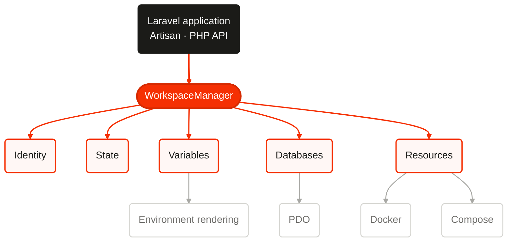
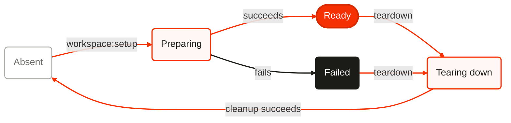

# Harbour architecture

Harbour is a Laravel package that turns the current checkout into an isolated
local workspace. It does not create the checkout and it does not supervise the
application. The package shares infrastructure where Laravel already supports
safe logical isolation, and creates a workspace-owned resource only where that
is necessary.

## Boundaries

The public entry points are thin Artisan commands and the injectable
`WorkspaceManager`. The manager coordinates focused domain services:

<!-- harbour:diagram id="components" alt="Harbour's Artisan and programmatic APIs coordinate focused identity, state, variable, database, environment, Docker, and Compose services through WorkspaceManager." -->

The domain layer does not depend on Laravel Console. Infrastructure adapters
may use Laravel's container, configuration repository, database manager,
events, filesystem, and process APIs.

Harbour supports three service modes:

- **shared**: Harbour points Laravel at an existing service and creates only a
  logical namespace, such as a database or Redis prefix;
- **docker**: Harbour creates a labelled, workspace-specific container;
- **compose**: Harbour starts a uniquely named Compose project from a project
  supplied Compose file.

None of these modes puts PHP, Node, Vite, Reverb, Horizon, or queue workers
under Harbour supervision.

## Lifecycle

The persisted state machine is deliberately small:

<!-- harbour:diagram id="lifecycle" alt="Harbour workspace states progress from absent through preparing to ready, while failures and teardown converge safely back to absent." -->

Every mutation is serialized by a workspace lifecycle lock. Setup writes
`preparing` before its first external mutation and persists each allocation or
owned resource immediately after it is acquired. A stage failure writes
`failed`, retaining all recorded ownership evidence. A later setup reconciles
the partial state; teardown can always remove the recorded subset.

Setup is convergent. Existing valid allocations and resources are reused.
`--fresh` first tears down only resources proven to be Harbour-owned and then
performs normal setup. Teardown is idempotent: missing resources are treated as
already removed, while mismatched ownership evidence is an error.

## Setup sequence

1. Refuse an unsafe runtime and acquire the workspace lifecycle lock.
2. Load and validate state, reusing its identity after a checkout move/rename.
3. Resolve Git/path identity and safe context-specific identifiers.
4. Reserve configured ports through the global registry and persist each one.
5. Resolve non-resource variables and prepare the original `.env` snapshot.
6. Create the database and persist its ownership record immediately.
7. Start configured Docker and Compose resources, persisting each resource.
8. Resolve the complete variable set and atomically render `.env`.
9. Run normal migrations, optional seeding, hooks, and Laravel events.
10. Validate the result and write `ready`.

## Teardown sequence

1. Acquire the same lifecycle lock and load the recorded state.
2. Run the before-teardown event and configured hooks.
3. Remove Compose and Docker resources after external ownership verification.
4. Remove the database after driver-specific ownership and safety checks.
5. Restore `.env` only if its rendered checksum still matches Harbour state.
6. Release recorded port reservations owned by this workspace.
7. Run the after-teardown hooks/event and atomically remove local state.

`--force` suppresses interaction and permits replacement of a modified
Harbour-rendered `.env`; it never bypasses resource, database, path, or Docker
ownership guards.

## State and locking

Workspace state is stored in `.harbour.json`, with schema version 1. Atomic
writes use a same-directory temporary file, `fsync` where available, mode
`0600`, and rename. JSON is validated on every read; malformed state raises
`HARBOUR_STATE_CORRUPTED` rather than being overwritten.

Workspace locks live under `.harbour/locks`. The machine-wide registry follows
XDG conventions (`$XDG_STATE_HOME/harbour`, otherwise
`~/.local/state/harbour`; macOS may use the same explicit fallback). Registry
updates hold an exclusive `flock`. A port is selectable only when it is absent
from live reservations and a loopback bind proves it currently available.
Reservations are keyed by workspace ID and named requirement. Deleted checkout
paths can be reconciled as stale; Harbour never destroys other resource types
merely because a path disappeared.

## Ownership

Every destructive operation starts from a versioned resource record written
before external creation begins. Records include a resource ID, workspace ID, type, creation
marker, driver, and sufficient immutable external identity. Teardown does not
derive a database/container/project name from current configuration.

Database resources use generated context-safe identifiers and retain the
connection fingerprint that created them. Docker resources additionally use
`dev.harbour.managed=true`, `dev.harbour.workspace`, and
`dev.harbour.resource` labels. A matching name without matching labels is not
owned. Compose resources retain their project name, config files, and working
directory; Compose removal is scoped to that project and does not request
external-resource or persistent-volume deletion by default.

SQLite records contain a normalized real parent path and must remain within the
workspace. Harbour creates a missing file, but never claims a pre-existing
file. Server databases are claimed only when Harbour itself created them.

## Variables

Variables are typed records with name, string value, source, secret flag, and
persistence flag. Lowest-to-highest precedence is:

1. persisted non-secret state (when reconstructing a workspace);
2. template-referenced values parsed from the pre-Harbour `.env`;
3. template-referenced process environment;
4. Harbour defaults;
5. workspace identity and namespace variables;
6. port allocations;
7. created resource variables;
8. configured project variables;
9. configured resolver classes, in order.

Later sources replace earlier values deterministically. Provenance follows the
winning value. Explicit `secret` metadata is authoritative; name-based
heuristics are an additional redaction boundary. Secret values are not written
to `.harbour.json` or diagnostic output. They may appear in the rendered `.env`
and its mode-`0600` backup because those files necessarily preserve application
configuration.

Harbour never imports unrelated names from `.env` or the process environment
into its public variable bag. Only placeholders required by `.env.harbour`
participate at those two precedence layers, limiting accidental disclosure of
application credentials through diagnostic commands.

The v1 renderer recognizes only `${VARIABLE}`. Missing variables raise
`UNRESOLVED_VARIABLE`; no placeholder becomes an empty string. Substitution is
literal and does not interpret shell syntax.

## Laravel isolation

Generated defaults align with Laravel's supported configuration surface:

- `REDIS_PREFIX` isolates general Redis keys, including Redis queue internals;
- `CACHE_PREFIX` isolates cache keys and cache-backed locks;
- `SESSION_COOKIE` prevents browser-cookie sharing across ports on one host;
- `QUEUE_PREFIX` and `QUEUE_NAME` provide an explicit workspace queue name for
  project queue configuration and worker commands;
- `HORIZON_PREFIX` isolates Horizon metadata when the project reads it;
- `VITE_PORT` and `VITE_HOT_FILE` isolate HMR endpoints and the hot marker;
- `REVERB_PORT` isolates the Reverb listener configuration.

Harbour publishes integration snippets rather than monkey-patching framework
internals. Projects retain control over their Laravel configuration files.

## Error and output model

Expected failures use stable `HARBOUR_*` codes with a safe context map. Console
text and JSON are two renderings of the same result. Secret-bearing contexts
are rejected/redacted at their source. Machine output schema version 1 has an
`ok` boolean and either workspace data or an `error` object.

## Release phases

1. Identity, identifiers, state, variables, `.env`, registry, and ports.
2. Database lifecycle, Laravel namespace defaults, manager, commands, events,
   hooks, and programmatic API.
3. Docker and Compose resource providers with external ownership checks.
4. Multi-process/failure/database/Redis/Docker integration hardening.
5. Static analysis, mutation testing, CI matrices, security review, and public
   documentation polish.
